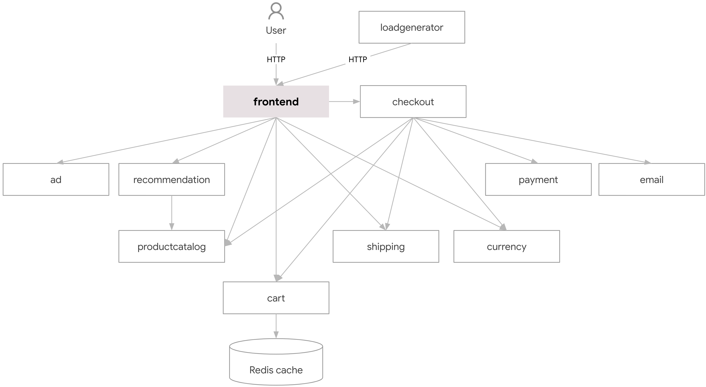

# Online Boutique: Cloud-Native Microservices Platform

## Overview
Online Boutique is a cloud-native microservices demo application that simulates an e-commerce platform. This repository demonstrates a production-grade deployment using modern DevOps practices and tools. The architecture consists of multiple microservices communicating with each other to provide a complete e-commerce experience.

## Architecture

### Microservices Components
- **Frontend Service** (Go) - Web interface for users
- **Cart Service** (C#) - Shopping cart data management
- **Product Catalog Service** (Go) - Product information management
- **Currency Service** (Node.js) - Currency conversion
- **Payment Service** (Node.js) - Payment processing
- **Shipping Service** (Go) - Shipping cost calculation
- **Email Service** (Python) - Order confirmation emails
- **Checkout Service** (Go) - Order processing
- **Recommendation Service** (Python) - Product recommendations
- **Ad Service** (Java) - Targeted advertisements

### Infrastructure Stack

#### Source Control
- GitHub repository
- Separate repositories for application and manifests
- PR-based workflow with branch protection

#### CI/CD Pipeline
- Jenkins for Continuous Integration
- ArgoCD for Continuous Deployment
- GitOps-based deployment workflow

#### Security & Quality
- SonarQube for code analysis
- Trivy for vulnerability scanning
- HashiCorp Vault for secrets management

#### Container Management
- Docker for containerization
- DockerHub as container registry

#### Orchestration
- Kubernetes for container orchestration
- Mixed service types (ClusterIP/NodePort)

## CI/CD Implementation

### Jenkins Pipeline
The CI pipeline automates:
1. Code analysis with SonarQube
2. Docker image building
3. Security scanning with Trivy
4. Image publishing to DockerHub
5. Manifest updates via PR

### Security Features
- HashiCorp Vault integration for secrets
- Container vulnerability scanning
- Static code analysis
- Secure credential management

### Deployment Strategy
- High availability with 3 replicas per service
- Health checks implementation
- Resource management
- Mixed service exposure:
  - Internal services: ClusterIP
  - Frontend: NodePort (30021)

## Prerequisites
- Kubernetes cluster
- Jenkins installation
- HashiCorp Vault
- SonarQube
- ArgoCD

## Getting Started
Check out our [Setup Guide](docs/setup.md) for detailed installation and configuration instructions.

## Screenshots

### Jenkins Pipeline
[Screenshot showing successful pipeline execution]

### SonarQube Analysis
[Screenshot showing code quality metrics]

### ArgoCD Deployment
[Screenshot showing application deployment status]

### Running Application
[Screenshot showing the deployed application]

## Monitoring & Maintenance

### Available Metrics
- Jenkins build status and logs
- SonarQube quality gates
- ArgoCD sync status
- Kubernetes cluster health
- Container metrics

### Maintenance Tasks
- Regular secret rotation
- Image updates
- Dependency management
- Security patch application

## Contributing
1. Fork the repository
2. Create a feature branch (`git checkout -b feature/amazing-feature`)
3. Commit your changes (`git commit -m 'Add amazing feature'`)
4. Push to the branch (`git push origin feature/amazing-feature`)
5. Open a Pull Request

## Future Roadmap
- Service mesh implementation
- Enhanced monitoring
- Automated testing pipeline
- Performance optimization
- Security hardening

## License
This project is licensed under the MIT License - see the [LICENSE](LICENSE) file for details.

## Acknowledgments
- [Link to original demo application]
- Infrastructure tool providers
- Contributors and maintainers

## Contact
Project Link: [https://github.com/yourusername/online-boutique](https://github.com/yourusername/online-boutique)
